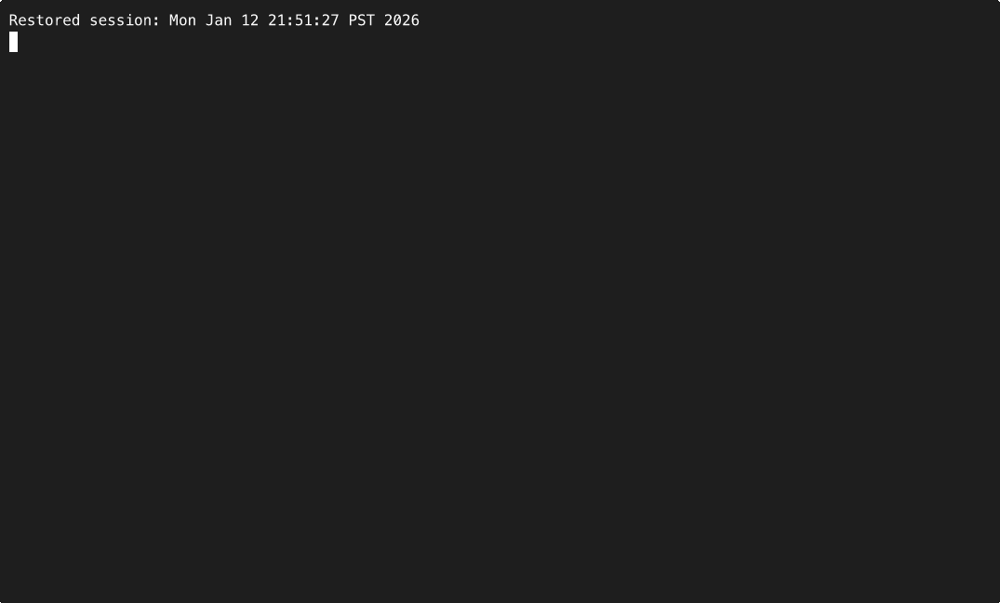

# PRUNE



Local-first CLI that analyzes a project directory and produces a safe, reviewable deletion plan
for likely-unused files and redundant artifacts.

## Install
Standard install from a checkout:
```
pip install .
```

Editable install for development:
```
pip install -e .[dev]
```

When published to PyPI:
```
pip install prune
```

## Quickstart
```
prune --path .
```

## Safety model
- Default is dry-run.
- Apply mode moves files to a timestamped trash directory and writes an undo script.
- No network access and no telemetry.
- Experimental dead-code detection is disabled by default.

## What it does
- Walks a project directory and builds a file map.
- Applies static heuristics (imports, text references, duplicate hashes, orphan configs, experiments).
- Scores each candidate with a confidence (0-1).
- Writes `deletion_plan.json`, `deletion_plan.md`, and `deletion_plan.diff`.

## Usage
Basic dry-run:
```
prune --path .
```

Apply mode (moves files to trash, no deletes):
```
prune --path . --apply --yes
```

Undo a previous apply:
```
./undo.sh
```

One-run safe defaults (threshold 0.65 + common exclusions):
```
prune --path . --one-run
```

Experimental dead-code detection (opt-in, slower and conservative):
```
prune --path . --experimental-dead-code --confidence-threshold 0.9 \
  --exclude 'tests/**' \
  --exclude 'docs/**' \
  --exclude 'examples/**' \
  --exclude '.github/**' \
  --exclude '.devcontainer/**' \
  --exclude '**/*.md' \
  --exclude '**/*.rst'
```

## Flags
- `--path`: target directory (default: current directory)
- `--dry-run`: default, generates plans without moving files
- `--apply`: move eligible files to `._trash_TIMESTAMP/` and create `undo.sh`
- `--yes`: required confirmation for `--apply`
- `--confidence-threshold`: only include candidates >= threshold (default: 0.4)
- `--include`: repeatable glob to include (relative to `--path`)
- `--exclude`: repeatable glob to exclude (relative to `--path`)
- `--experimental-dead-code`: include symbol-level dead-code candidates (experimental, slower)
- `--one-run`: safer defaults (threshold 0.65, auto-excludes tests/docs/examples/.github/.devcontainer) and banner
- `--version`: print the version and exit

## Outputs
- `deletion_plan.json`: structured results for tooling
- `deletion_plan.md`: human-readable plan with warnings
- `deletion_plan.diff`: unified diff preview of file removals
- `undo.sh`: only in apply mode; stored at the target root (and copied into the trash directory)
- `CLOSURE.md`: written after apply with a full move manifest

## Troubleshooting
- Too many candidates: raise `--confidence-threshold` or add `--exclude` globs.
- Dead-code false positives: leave it disabled or treat as advisory only.
- Slow scans: reduce scope with `--include` or exclude large directories.

## Reset / uninstall
- Remove trash directories: `rm -rf ._trash_*`
- Remove generated plans: `rm -f deletion_plan.json deletion_plan.md deletion_plan.diff CLOSURE.md`
- Uninstall editable install: `pip uninstall prune`

## Release
1) Run `ruff check` and `pytest`.
2) Build artifacts: `python -m build`.
3) Build the release zip: `bash gumroad_upload/build_release_zip.sh`.
4) Tag: `git tag -a vX.Y.Z -m "vX.Y.Z"`.

## Development
```
ruff check
pytest
```

## Notes
This tool is conservative. Anything flagged still requires review.
Dead-code detection is experimental and disabled by default.
